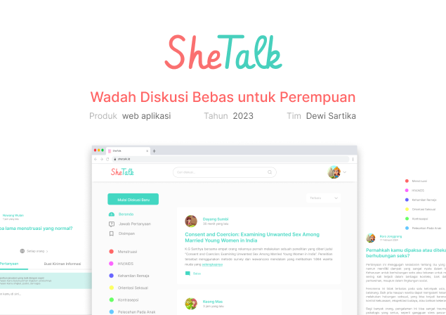

# Group Project Web SheTalk

This Project is [Final Project Fullstack Web Development](https://github.com/impactbyte/full-stack-web-assignments/tree/master/Final-Project-Fullstack-Web-development) from the Skilvul Bootcamp Full Stack Web Development (Bootcamp Perempuan Inovasi 2023).
I built this website with my team using ReactJS, Redux, Bootstrap, ExpressJ, MySQL. 
**The code for the client-side can be found on the front-end branch, while the code for the server-side is located on the back-end branch**

### Since the server is not deployed anymore because the free trial has ended, you can watch the demo here: [DEMO SHETALK](https://drive.google.com/file/d/1O4fVSXtCu_j6Xy0Fe2SSF8PFC3d-w2Nn/view?usp=sharing)

### Cover

### About
Shetalk - A platform or forum where women can share their experiences, questions, and knowledge about reproductive and sexual health.

### Users
There are two users in this website
1. User General
2. User Ahli

### Features
Each user has different features or access rights.
1. User General
    - Selecting an avatar before joining the discussion.
    - Creating questions in the discussion room.
    - Sharing experiences in the discussion room.
    - Can view comments
2. User Ahli
    - Having an account created by the developer.
    - Creating questions in the discussion room.
    - Sharing knowledge or posts in the discussion room.
    - Commenting on posts from other users.
    - Answering questions from general users.
    - Having an editable profile page.
    - In accordance with the regulations, receiving certificate and badge awards.

### Links

- Live Site URL: [SheTalk](https://shetalk-app.netlify.app/)
- Live Site URL for Ahli: [SheTalk for Ahli](https://shetalk-app.netlify.app/login.html)
  - Login Ahli : email = ahli@shetalk, pw = password
- Wireframe and Details : [BRD](https://www.figma.com/file/hlc31ZFnZWkNtzledk7fQk/Final-Deliverable---Dewi-Sartika)
